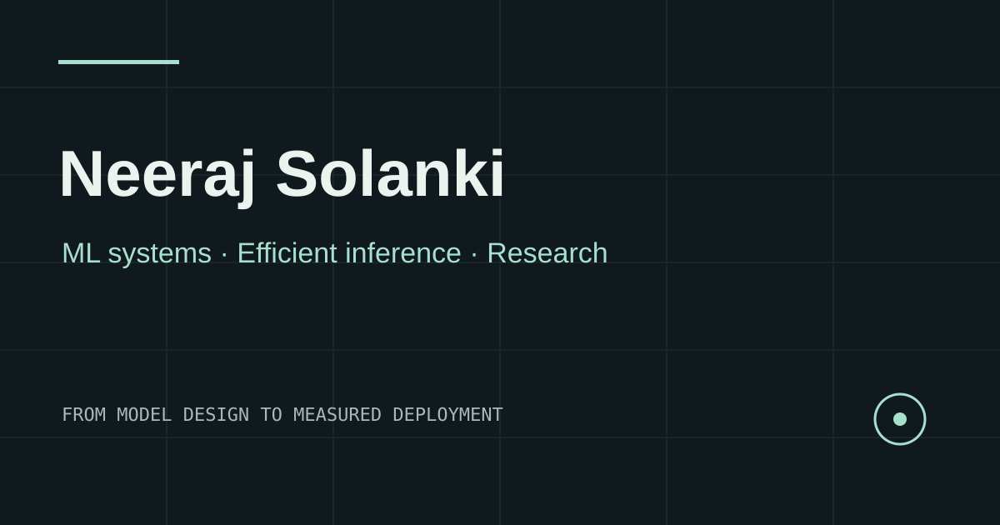

# Neeraj Solanki — ML Systems Portfolio

A static portfolio for [Neeraj Solanki](https://solankineeraj03.github.io), focused on efficient AI systems, inference measurement, and hardware-aware research.

**Live site:** https://solankineeraj03.github.io  
**Stack:** Astro, TypeScript, Tailwind CSS, lightweight browser JavaScript, Lucide icons, GitHub Pages.

## Develop

Requires Node.js 22 or newer.

```sh
npm ci
npm run dev
```

## Verify and build

```sh
npm run lint
npm run check
npm run build
npx playwright install chromium
npm test
```

`npm run preview` serves the production build. Playwright tests cover routing, resume download, filters, chart controls, command palette, theme persistence, mobile navigation, and layout overflow.

## Update content

- Edit structured projects, publications, experience, expertise, links, and benchmark data in `src/data/content.ts`.
- Edit the narrative and layout in `src/pages/index.astro`; case studies are generated from the project data by `src/pages/projects/[slug].astro`.
- Replace `public/resume/Neeraj_Solanki_Resume.pdf` with the latest public PDF at the same path.
- Update `CONTENT_AUDIT.md` when changing factual claims. Chart values should be checked against source artifacts before editing.

## Deployment

The repository is the GitHub user site, so Astro uses `https://solankineeraj03.github.io` with no base path. On a push to `main`, GitHub Actions runs lint, type checks, a production build, and browser tests before deploying `dist` to GitHub Pages. The project has no runtime backend, tracking scripts, or browser API keys.



## License

MIT. Resume and portrait remain the property of Neeraj Solanki and are excluded from the software license.
